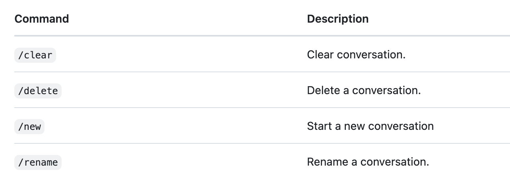

### Domain: How GitHub Copilot works and handles data
### Question 1
**Correct Answer: C**

- **Option C is CORRECT** because GitHub Copilot operates with a
limited context window, which means it can only see a certain number of tokens (which
includes both the prompt and relevant surrounding code) when generating suggestions. In
larger files, important context might lie outside this window, which may lead to less
accurate or relevant completions.

- **Option A is INCORRECT** because GitHub Copilot does not
specifically require any manual fine-tuning per file. It operates on a high level based
on the visible context available in the editor while the user is writing their code.

- **Option B is INCORRECT** as the IDE’s memory does not directly
impact Copilot's AI model response. The suggestions come from cloud-based inference and
depend on the context sent, not local processing power. So, this option is incorrect.

- **Option D is INCORRECT** because GitHub Copilot does not disable
code completions itself based on the file size. However, the effectiveness may drop due
to context limits, but there are no hard-coded restrictions.

**Reference:**

- [GitHub Copilot - Prompting guidance based on Context](https://learn.microsoft.com/en-us/visualstudio/ide/copilot-chat-context?view=vs-2022#prompting-guidance)

### Domain: GitHub Copilot plans and features
### Question 2
**Correct Answer: A**

- **Option A is CORRECT** because this set of commands are most
widely used and valid commands in GitHub Copilot CLI. Here’s the detailed explanation:

- gh Copilot explain: Used to get the explanation of code or
commands.

- gh Copilot suggest: Ask Copilot to provide suggestions for
performing a Task.

- gh Copilot extension list: Displays all the available
extensions and also indicates the proper installation of Copilot.

This set of commands can enable developers to interact with AI from the terminal in
a seamless way.

- **Option B is INCORRECT** because these commands are not a valid
set of commands for GitHub CLI. They sound generic but in reality, they don't exist.

- **Option C is INCORRECT** because these commands do not belong to
GitHub Copilot CLI and cannot be related with Copilot.

- **Option D is INCORRECT** as commands like Copilot init and
Copilot deploy do not exist in GitHub Copilot’s CLI toolkit. These are just distractors
to deviate from the actual choice.

**Reference:**

- [https://docs.github.com/en/Copilot/using-github-Copilot/using-github-Copilot-in-the-command-line](https://docs.github.com/en/copilot/using-github-copilot/using-github-copilot-in-the-command-line)

### Domain: GitHub Copilot plans and features
### Question 3
**Correct Answers: A and B**

- **Option A is CORRECT** because ghcs is a commonly configured
alias for the GitHub Copilot CLI command to suggest code. It simplifies the user
experience by allowing developers to quickly prompt Copilot from the terminal.

- **Option B is CORRECT** because ghce stands for GitHub Copilot
Explain and is another helpful alias that allows developers to request natural language
explanations for code from the terminal.

- **Option C is INCORRECT** because ghinit is not a valid alias and
has no specific connection with GitHub Copilot functionality.

- **Option D is INCORRECT** because while GitHub Copilot can assist
with code generation, ghshare is not a recognized alias in the Copilot CLI context.

- **Option E is INCORRECT** because ghrun is not an alias related
to GitHub Copilot commands; it may be confused with GitHub Actions or workflow-related
commands but is not valid for Copilot CLI.**

**Reference:**

- [https://docs.github.com/en/Copilot/managing-Copilot/configure-personal-settings/configuring-github-Copilot-in-the-cli#setting-up-aliases](https://docs.github.com/en/copilot/managing-copilot/configure-personal-settings/configuring-github-copilot-in-the-cli#setting-up-aliases)

### Domain: Prompt Crafting and Prompt Engineering
### Question 4
**Correct Answer: A**

- **Option A is CORRECT** because GitHub Copilot Chat leverages
chat history within the current session to maintain context, enabling it to give
equivalent and relevant replies based on the ongoing conversation. However, once the
session ends, this context is cleared, ensuring user privacy. This approach helps the
copilot to generate relevant answers by leveraging the recent chat history.

- **Option B is INCORRECT** because GitHub Copilot Chat does not
store conversations permanently or retrain its models based on individual users’
history. This protects user confidentiality and complies with data privacy standards.

- **Option C is INCORRECT** as Copilot Chat does not sync chats
across users or accounts. Each session remains isolated to avoid data sharing between
individuals or teams. So, this cannot be a valid choice.

- **Option D is INCORRECT** because while GitHub Copilot can offer
suggestions based on the open files or visible code in the IDE, it does not analyze
GitHub activity history to modify its responses in chat. This is not an existing feature
that Copilot offers.

**Reference:**

- [Get better answers by setting the context for GitHub Copilot Chat in Visual Studio](https://learn.microsoft.com/en-us/visualstudio/ide/copilot-chat-context?view=vs-2022)

### Domain: Prompt Crafting and Prompt Engineering
### Question 5
**Correct Answers: A, B and C**

- **Option A is CORRECT** because when you initiate writing your
code and need assistance from Copilot it's always a best practice to write the comments
which include proper description of the task that you want to perform before starting
with your code. If your purpose is clearly understandable in the comments, then it will
help Copilot to generate very accurate suggestions.

- **Option B is CORRECT** because when you include examples along
with the prompts, it will enable Copilot to understand the expected pattern and the
outcome that you are expecting it to return, this will not just help you get the quality
suggestions from Copilot but also it can remember it for the upcoming code blocks.

- **Option C is CORRECT,** as avoiding vague prompts such as
“//generate function” or “//Create Tests” is essential. These don’t convey what the
function is supposed to do, so Copilot’s output will be a random guess.

- **Option D is INCORRECT** because using unrelated keywords will
confuse Copilot and reduce output quality. This is not a recommended strategy and
doesn’t contribute to effective prompting.So, make sure that all the keywords that you
use while writing the prompt are inline and relevant to the problem statement.

- **Option E is INCORRECT** because While GitHub Copilot is a
powerful AI assistant trained on a wide range of code patterns, it is not a mind reader.
It relies heavily on the context you provide. That’s why using vague prompts like "write
test" or "fix this" is not a good practice, especially for SDETs.

**Reference:**

- ** **[Prompting guidance](https://learn.microsoft.com/en-us/visualstudio/ide/copilot-chat-context?view=vs-2022#prompting-guidance)

### Domain: Developer use cases for AI
### Question 6
**Correct Answers: A, B and D**

- **Option A is CORRECT** because Average Daily Active Users is a
key adoption metric that shows how many developers are actively using GitHub Copilot
each day within a given organization or repository scope. This information allows
engineering managers and clients to understand how widely Copilot is being accepted
across the team, and whether it's being consistently integrated into developer
workflows. High active users' values typically reflect good engagement and continuous
reliance on Copilot as a daily coding assistant.

- **Option B is CORRECT** because the Total Acceptance Rate (TAR)
helps assess how often developers accept Copilot’s code suggestions after they are
presented. A high TAR can indicate that developers find the suggestions relevant,
useful, and trustworthy. This metric provides a direct way to measure Copilot's
influence on developer productivity, since the more developers accept the suggestions,
the more the tool contributes to the actual code contributions.

- **Option D is CORRECT** as Lines of Code Accepted is a direct
quantitative measure of how much Copilot-generated code is actually making its way into
the codebase. This metric can help organizations assess how significantly Copilot
contributes to the overall code output. It also offers tangible evidence of time and
effort saved, especially in larger codebases where boilerplate and repetitive patterns
are common.

- **Option C is INCORRECT** because while it’s true that developers
often modify or adjust Copilot's suggestions before accepting them, GitHub’s
Productivity API does not currently have any capability to provide a metric that tracks
how much a suggestion was manually edited before being accepted. This kind of analysis
would require deeper IDE-level instrumentation and is not currently captured in the
Productivity API metrics.

- **Option E is INCORRECT** because the Productivity API does not
track operational or post-deployment metrics like production incidents or bugs caused by
Copilot suggestions. Additionally, as part of the best practices, using the Copilot
generated code directly in production is not a typical example of responsible AI. It’s
always suggested that all users must go through and entirely test the code generated by
Copilot before deploying it to the production environments.

**Reference:**

- [Implementing a measurement framework](https://learn.microsoft.com/en-us/training/modules/developer-use-cases-for-ai-with-github-copilot/5-understand-limitations-measure-impact?ns-enrollment-type=learningpath&ns-enrollment-id=learn.github-copilot-2)

### Domain: Privacy fundamentals and content exclusions
### Question 7
**Correct Answers: B and D**

- **Option B is CORRECT** because GitHub Copilot leverages its
training data to recognise insecure coding patterns such as SQL injections, use of
hardcoded credentials, or unsafe function usage. When it detects such patterns, it may
suggest safer alternatives like parameterised queries or environment variables to
improve code security. Although it's up to the user to accept them or not.

- **Option D is CORRECT** because GitHub Copilot does not perform
active static analsis or runtime scanning. Instead, it relies on its language model
trained on public code and best practices. It can make intelligent suggestions by
recognising potentially risky coding structures or patterns, but it does not raise
security alerts like a dedicated vulnerability scanner.

- **Option C is INCORRECT** because Copilot does not block users
from writing known CVE-associated patterns. It’s a suggestion engine, not an enforcement
tool. It may avoid suggesting dangerous patterns, but it won’t actively prevent code
from being written.

- **Option D is INCORRECT** because Copilot does not perform
real-time static analysis. GitHub offers other tools like CodeQL or Dependabot for
scanning and vulnerability alerts, but these are separate from Copilot's functionality.

**Reference:**

- [Security best practices with GitHub Copilot](https://github.blog/ai-and-ml/github-copilot/github-for-beginners-security-best-practices-with-github-copilot/#lets-talk-security)

### Domain: Privacy fundamentals and content exclusions
### Question 8
**Correct Answers: B and D**

- **Option B is CORRECT** because, even when files are excluded,
some IDEs like Visual Studio Code may still expose semantic data, such as symbol
definitions or type information, from excluded files. GitHub Copilot can use that
visible data in its suggestions, which makes the exclusions not fully effective in
practice.

- **Option D is CORRECT** because GitHub Copilot Chat does not
honour exclusions when queries are made using the “@github” participant in IDEs like
Visual Studio or VS Code. This means developers might inadvertently access excluded file
content via chat.

- **Option A is INCORRECT** because the platform, such as the web
interface or IDE, has no impact on the enforcement of content exclusions. GitHub Copilot
enforces exclusions based on file and repository settings, regardless of where code is
being edited.

- **Option C is INCORRECT** because GitHub supports exclusions at
the repository and organisation levels as well, not just at the enterprise level. This
is well-documented in Copilot’s configuration documentation. So this option does not
offer a valid choice.

- **Option E is INCORRECT** because copying content from an
excluded file into a new, non-excluded file is essentially removing the protection. Once
that content is outside the exclusion zone, it’s expected to be included in suggestions;
it’s not a limitation of the exclusion feature itself.

**References:**

- [Limitations of content exclusions](https://docs.github.com/en/copilot/managing-copilot/configuring-and-auditing-content-exclusion/excluding-content-from-github-copilot#limitations-of-content-exclusions)

- [Manage content exclusions](https://learn.microsoft.com/en-us/training/modules/github-copilot-management-and-customizations/4-manage-content-exclusions?ns-enrollment-type=learningpath&ns-enrollment-id=learn.github-copilot)

### Domain: Privacy fundamentals and content exclusions
### Question 9
**Correct Answers: A and C**

- **Option A is CORRECT** because Copilot relies heavily on
context. When the initial comment or prompt is vague or too short, it may not generate
helpful suggestions. Rewriting your comment with a specific goal in mind, such as naming
the function, clarifying expected inputs and outputs, or stating the goal, can help
Copilot better understand your expectations or aspirations. Think of it like giving a
helpful nudge: instead of using comments such as “// helper function”, use something
like “// helper function to compare two user tokens and return true if they match”.

- **Option C is CORRECT** because Copilot can parse inline comments
and docstrings to understand what your code is trying to do. When suggestions are
lacking, try adding clear explanations just above your function. This can give it the
necessary clues to generate relevant code. These contextual hints can gradually increase
the quality of what Copilot offers, especially in test case writing.

- **Option B is INCORRECT** because just continuing to type won’t
necessarily make Copilot respond better. If the model doesn’t have enough contextual
information from your prompts, it won’t “catch up” or magically can’t guess what’s
needed. Adding better structure or prompts is more effective than simply hoping it will
improve on its own.

- **Option D is INCORRECT** because turning Copilot off and on
again doesn’t reset any intelligent behaviour. Copilot doesn’t store personal “learning”
on your machine that can be refreshed this way. Its suggestions are generated based on
the current code context and comments; it doesn't have session-based memory to reset.

- **Option E is INCORRECT** because GitHub Copilot is designed to
support multiple programming languages simultaneously. If you’re working in Python and
not getting good suggestions, switching to JavaScript won’t improve Copilot’s responses.
The key is not the language itself, but how you guide Copilot by providing proper
direction in the form of prompts and comments in any language.

**Reference:**

- [Using GitHub Copilot in your IDE: Tips, tricks, and best practices - #context-context-context](https://github.blog/developer-skills/github/how-to-use-github-copilot-in-your-ide-tips-tricks-and-best-practices/#context-context-context)

### Domain: Developer use cases for AI
### Question 10
**Correct Answer: D**

- **Option D is CORRECT** because GitHub Copilot generates
suggestions based on patterns in publicly available code but does not evaluate
performance trade-offs, architecture efficiency, or business-critical constraints.
Developers should treat its output as a first draft, not a final version. Especially in
performance-sensitive modules, human intervention is key to auditing, refactoring, and
optimizing the code.

- **Option A is INCORRECT** because Copilot is not designed to be
an automatic expert-level performance optimizer. It does not replace algorithmic
thinking or project-specific tuning. Developer skill is still required to ensure quality
and efficiency. It cannot directly deliver the production-ready code.

- **Option B is INCORRECT** as Copilot does not run benchmarks or
test its code. It doesn't self-improve or evaluate suggestions during runtime. So, it's
the responsibility of the developer to test, validate, and improve the code after
generation.

- **Option C is INCORRECT** because by default copilot doesn’t
block any performance critical systems, although it cannot help you very effectively
with the entire request, but can still help with the code suggestions on a high level or
with an idea of implementation of the code workflow or how to perform specific tasks.

**Reference:**

- [Understand limitations and measure impact](https://learn.microsoft.com/en-us/training/modules/developer-use-cases-for-ai-with-github-copilot/5-understand-limitations-measure-impact?ns-enrollment-type=learningpath&ns-enrollment-id=learn.github-copilot-2)

### Domain: Responsible AI
### Question 11
**Correct Answer: A**

- **Option A is CORRECT** because AI-generated responses,
especially in customer-facing communication, can unintentionally reflect biases,
stereotypes, or inappropriate phrasing. Validating the output ensures messaging is
ethical, inclusive, and aligns with the organization’s brand values, helping avoid
reputational and compliance risks.

- **Option B is INCORRECT** because while minor grammatical issues
may occur, most modern AI tools generate well-structured and coherent sentences. The
greater concern lies in bias and cultural insensitivity, which are more likely to cause
ethical or reputational issues.

- **Option C is INCORRECT** since qualification is subjective. The
focus should not be on individual roles but rather on implementing a consistent review
process to check for accuracy, tone, and compliance, regardless of who is reviewing the
content.

- **Option D is INCORRECT** because customers are increasingly open
to engaging with AI-powered tools, especially when responses are accurate and
respectful. The emphasis should be on ensuring trust and responsibility, not assuming
automatic rejection.

**References:**

- [https://learn.microsoft.com/en-us/training/modules/embrace-responsible-ai-principles-practices/2-prepare-implications-responsible-ai](https://learn.microsoft.com/en-us/training/modules/embrace-responsible-ai-principles-practices/2-prepare-implications-responsible-ai)

- [https://github.com/microsoft/vscode/issues/245281](https://github.com/microsoft/vscode/issues/245281)

### Domain: Responsible AI
### Question 12
**Correct Answer: B**

- **Option B is CORRECT** because when AI models are trained on
historical data, they inherit existing biases in that dataset. In this case, if prior
hiring decisions favored a specific demographic, the AI will replicate and perpetuate
this bias unless bias mitigation strategies are applied.

- **Option A is INCORRECT** because while a low volume of data can
reduce the overall effectiveness of the model, it **does not automatically result
in biased outcomes.** Bias arises from **unbalanced** or
**skewed data**, not just insufficient data.

- **Option C is INCORRECT** because formatting issues typically
lead to **technical problems** like unreadable resumes or missing
information. They do not explain **consistent demographic trends** like
favoring one gender or region.

- **Option D is INCORRECT** because while legal or compliance
constraints can affect how hiring workflows are designed, they **do not directly
lead to biased filtering **unless the system is explicitly using regional or
demographic filters, which isn’t implied here.

**Reference:**

- [https://learn.microsoft.com/en-us/azure/well-architected/ai/responsible-ai](https://learn.microsoft.com/en-us/azure/well-architected/ai/responsible-ai)

### Domain: Responsible AI
### Question 13
**Correct Answer: C**

- **Option C is CORRECT** because responsible AI emphasizes
transparency, accountability, and explainability—especially in sensitive industries like
healthcare, where decisions can directly impact human lives. Clearly articulating the
capabilities, constraints, and reasoning behind AI outputs builds trust with clinicians
and patients, facilitates regulatory compliance, and supports informed decision-making.

- **Option A is INCORRECT** as failure to document development
decisions undermines traceability and weakens the ability to perform audits or address
issues post-deployment. Responsible AI frameworks, including Microsoft's and ISO/IEC
standards, advocate for robust documentation throughout the AI lifecycle.

- **Option B is INCORRECT** because engaging end users, especially
domain experts and affected stakeholders, is a critical step in responsible model
development. Bypassing user input not only risks deploying misaligned models but also
violates principles of inclusivity and collaborative validation.

- **Option D is INCORRECT** since ethical and responsible AI
requires balancing innovation speed with comprehensive testing. Sacrificing fairness or
bias evaluation for fast delivery can lead to unintended harm, regulatory penalties, or
public mistrust—particularly in domains involving health, safety, or finance.

**References:**

- [https://www.microsoft.com/en-us/ai/responsible-ai](https://www.microsoft.com/en-us/ai/responsible-ai)

- [https://support.microsoft.com/en-us/topic/what-is-responsible-ai-33fc14be-15ea-4c2c-903b-aa493f5b8d92](https://support.microsoft.com/en-us/topic/what-is-responsible-ai-33fc14be-15ea-4c2c-903b-aa493f5b8d92)

- [https://github.com/kkm24132/ResponsibleAI](https://github.com/kkm24132/ResponsibleAI)

### Domain: Responsible AI
### Question 14
**Correct Answer: C**

- **Option C is CORRECT** because conducting fairness audits and
applying stress testing across different demographic groups are critical practices in
mitigating algorithmic harms. These methods help proactively identify unintended bias in
model outcomes, enabling the team to take corrective actions before the system is
deployed. Fairness audits evaluate disparities across sensitive attributes (e.g.,
gender, age, ethnicity), while stress testing simulates edge-case scenarios to assess
the model’s robustness and equity. This aligns with responsible AI principles that
emphasize fair treatment, transparency, and inclusivity in machine learning systems.

- **Option A is INCORRECT** because naively removing all
features—especially those that may contribute to decision accuracy—can substantially
reduce model performance. Moreover, this doesn't guarantee fairness. Bias can still
sneak in through proxy variables (e.g., zip code correlating with ethnicity), so the
solution requires deeper evaluation rather than feature elimination alone.

- **Option B is INCORRECT** since passing accuracy benchmarks
doesn’t imply ethical soundness. A model may perform well overall but still produce
unfair or disparate outcomes for specific subgroups. Responsible AI frameworks urge
practitioners to consider both performance and fairness, treating them as complementary
pillars—not trade-offs.

- **Option D is INCORRECT** because relying on manual overrides
after the model has made a prediction introduces inconsistency and lacks transparency.
It also creates dependency on human judgment that may be subjective or biased in itself.
Rather than patching outcomes post hoc, a systemic approach through bias detection and
mitigation during development is far more effective and accountable.

**Reference:**

- [https://github.com/holistic-ai/mitigation-roadmaps](https://github.com/holistic-ai/mitigation-roadmaps)

### Domain: Responsible AI
### Question 15
**Correct Answer: B**

- **Option B is CORRECT** because at the heart of ethical AI lies a
commitment to protecting user rights and fostering trust. Ensuring user consent,
maintaining data privacy, and upholding transparency are essential pillars of
responsible AI systems. Especially in customer-facing applications, ethical deployment
requires that users understand how their data is used and that they retain agency over
that usage. These principles not only align with global data protection regulations like
GDPR but also enhance long-term adoption and public trust in AI technologies.

- **Option A is INCORRECT** because prioritizing profit at the
expense of ethical considerations often results in design shortcuts, lack of
accountability, and potentially harmful outcomes. Such practices can erode trust and
invite regulatory scrutiny.

- **Option C is INCORRECT** since choosing algorithms purely based
on their popularity or technical appeal (e.g., deep learning or neural networks) may not
yield the best results in every use case. Ethical AI development requires context-aware
decision-making, where explainability and appropriateness often outweigh raw complexity.

- **Option D is INCORRECT** because automation for efficiency must
be tempered with ethical oversight. Reducing human involvement without safeguards can
strip decision-making of empathy, introduce bias, and expose systems to cascading errors
with real-world consequences.

**References:**

- [https://docs.github.com/en/site-policy/privacy-policies/github-general-privacy-statement#data-privacy-framework-dpf](https://docs.github.com/en/site-policy/privacy-policies/github-general-privacy-statement#data-privacy-framework-dpf)

- [https://github.com/kkm24132/ResponsibleAI](https://github.com/kkm24132/ResponsibleAI)

### Domain: GitHub Copilot plans and features
### Question 16
**Correct Answer: B**

- **Option A is INCORRECT** because GitHub Copilot Chat does not
handle version control actions like committing or pushing code. These tasks are
performed through Git or GitHub tools, not through the chat interface. The chat
assistant is focused on code guidance, not direct repository manipulation.

- **Option B is CORRECT** because Copilot Chat is designed to
assist developers within the IDE by responding to natural language prompts, generating
code snippets, explaining complex logic, and offering suggestions in real time — all in
context with the currently open file and project.

- **Option C is INCORRECT** because Copilot Chat does not perform
repository security analysis or generate templates for pull requests. Those are
administrative or DevOps features unrelated to Copilot Chat’s AI-assisted coding
support.

- **Option D is INCORRECT** because while Copilot Chat can
interpret comments and code, it is not intended to translate spoken languages. It
focuses on code-related natural language understanding, not linguistic translation.

**Reference:**

- [https://docs.github.com/en/copilot/responsible-use-of-github-copilot-features/responsible-use-of-github-copilot-chat-in-your-ide](https://docs.github.com/en/copilot/responsible-use-of-github-copilot-features/responsible-use-of-github-copilot-chat-in-your-ide)

### Domain: GitHub Copilot plans and features
### Question 17
**Correct Answers: B and C**

- **Option A is INCORRECT** because GitHub Copilot for CLI is
available to both Individual and Business users. It’s not a differentiating feature of
the Business plan.

- **Option B is CORRECT** because GitHub Copilot Business offers IP
indemnity, meaning GitHub provides legal protection in case of intellectual property
disputes related to code suggestions. This is not available in the Individual plan.

- **Option C is CORRECT** because Copilot Business supports
organization-level management, such as enabling/disabling Copilot access for teams,
tracking usage, and enforcing policies — critical for enterprise control.

- **Option D is INCORRECT** as GitHub Actions runners are a
separate service. Copilot Business does not provide free or private runners as part of
its subscription.

**References:**

- [https://learn.microsoft.com/en-us/training/modules/introduction-to-github-copilot-for-business/2-about-github-copilot-business](https://learn.microsoft.com/en-us/training/modules/introduction-to-github-copilot-for-business/2-about-github-copilot-business)

- [https://docs.github.com/en/copilot/about-github-copilot/what-is-github-copilot](https://docs.github.com/en/copilot/about-github-copilot/what-is-github-copilot)

### Domain: GitHub Copilot plans and features
### Question 18
**Correct Answer: B**

- **Option A is INCORRECT** because this endpoint is for
configuring webhooks in a repository, unrelated to billing or Copilot subscriptions.

- **Option B is CORRECT** because this is the dedicated API
endpoint for managing GitHub Copilot Business billing and usage at the organization
level. It allows programmatic insights into license distribution, billing periods, and
more.

- **Option C is INCORRECT** since it refers to social features like
following users, which has no relevance to Copilot usage or subscriptions.

- **Option D is INCORRECT** because this endpoint applies to
general enterprise settings, not specific to Copilot licensing or billing.

**References:**

- [https://docs.github.com/en/enterprise-cloud@latest/rest/copilot?apiVersion=2022-11-28](https://docs.github.com/en/enterprise-cloud@latest/rest/copilot?apiVersion=2022-11-28)

- [https://docs.github.com/en/copilot/about-github-copilot/what-is-github-copilot](https://docs.github.com/en/copilot/about-github-copilot/what-is-github-copilot)

### Domain: GitHub Copilot plans and features
### Question 19
**Correct Answer: C**

- **Option A is INCORRECT** because modifying secrets inline is not
permitted due to security concerns. GitHub Copilot Chat does not access or modify
secrets.

- **Option B is INCORRECT** since Copilot Chat does not integrate
with calendars or issue scheduling features.

- **Option C is CORRECT** because GitHub Copilot Chat on GitHub.com
enables inline code understanding — it reads context from visible code and responds with
explanations, summaries, or suggestions without switching to an IDE.

- **Option D is INCORRECT** because auto-merging pull requests
across forks is a repo-level setting and not related to Copilot Chat functionality.

**References:**

- [https://docs.github.com/en/copilot/using-github-copilot/copilot-chat/getting-started-with-prompts-for-copilot-chat](https://docs.github.com/en/copilot/using-github-copilot/copilot-chat/getting-started-with-prompts-for-copilot-chat)

- [https://docs.github.com/en/copilot/responsible-use-of-github-copilot-features/responsible-use-of-github-copilot-chat-in-your-ide](https://docs.github.com/en/copilot/responsible-use-of-github-copilot-features/responsible-use-of-github-copilot-chat-in-your-ide)

### Domain: GitHub Copilot plans and features
### Question 20
**Correct Answer: B**

- **Option A is INCORRECT** because while Copilot may assist with
test code generation, browser testing setup and automation is usually better handled
through scripts and frameworks — not a strong Chat use case.

- **Option B is CORRECT** because Copilot Chat shines when helping
developers understand, debug, and explain code — especially during onboarding or while
reviewing legacy code.

- **Option C is INCORRECT** since sprint planning is a project
management task, not one Copilot Chat is equipped to handle.

- **Option D is INCORRECT** because Copilot Chat does not export
analytics; it is not integrated with reporting tools or dashboards.

**Reference:**

- [https://docs.github.com/en/copilot/using-github-copilot/copilot-chat/asking-github-copilot-questions-in-github](https://docs.github.com/en/copilot/using-github-copilot/copilot-chat/asking-github-copilot-questions-in-github)

### Domain: GitHub Copilot plans and features
### Question 21
**Correct Answers: A and C**

- **Option A is CORRECT** because Copilot Chat relies heavily on
context windows. When files are too large, context injection becomes slower and less
effective. Modularizing code allows Copilot to focus on relevant parts, improving speed
and accuracy.

- **Option B is INCORRECT** because GitHub Copilot Chat runs
inference on cloud-based servers — not your local machine. Upgrading your hardware won’t
affect response time.

- **Option C is CORRECT** because short, precise prompts are easier
for Copilot to process. This increases the relevance and speed of suggestions,
especially during heavy usage periods.

- **Option D is INCORRECT** because while Labs may offer
experimental capabilities, they do not guarantee improved performance and are meant for
feature exploration, not optimization.

**Reference:**

- [https://docs.github.com/en/copilot/using-github-copilot/copilot-chat/getting-started-with-prompts-for-copilot-chat](https://docs.github.com/en/copilot/using-github-copilot/copilot-chat/getting-started-with-prompts-for-copilot-chat)

### Domain: GitHub Copilot plans and features
### Question 22
**Correct Answer: B**

- **Option A is INCORRECT** because Copilot Chat can explain
comments and even convert them into code — this is part of its core functionality.

- **Option B is CORRECT** because, like all generative AI models,
Copilot may produce insecure or inefficient code. It doesn’t validate outputs for
security, so manual review is critical to avoid vulnerabilities.

- **Option C is INCORRECT** because Copilot Chat does not handle
file management — it operates in-session within your IDE/editor and does not delete or
manage files.

- **Option D is INCORRECT** as Copilot Chat is available under
Copilot for Individuals and Business; it does not require a GitHub Enterprise plan.

**Reference:**

- [https://docs.github.com/en/copilot/responsible-use-of-github-copilot-features/responsible-use-of-github-copilot-chat-in-github](https://docs.github.com/en/copilot/responsible-use-of-github-copilot-features/responsible-use-of-github-copilot-chat-in-github)

### Domain: GitHub Copilot plans and features
### Question 23
**Correct Answer: A**

- **Option A is CORRECT** because /regenerate is a valid slash
command in Copilot Chat. It tells the model to try again with a different suggestion
while staying in the same context.

****

- **Option B is INCORRECT** as GitHub Actions has no connection to
Copilot Chat suggestions or IDE-level code generation.

- **Option C is INCORRECT** because restarting the IDE won’t
generate alternative suggestions and is unnecessary for that use case.

- **Option D is INCORRECT** because while GitHub.com Copilot Chat
exists, the alternative generation functionality is specific to the in-IDE experience.

**Reference:**

- [https://docs.github.com/en/copilot/using-github-copilot/copilot-chat/github-copilot-chat-cheat-sheet#slash-commands](https://docs.github.com/en/copilot/using-github-copilot/copilot-chat/github-copilot-chat-cheat-sheet#slash-commands)

### Domain: GitHub Copilot plans and features
### Question 24
**Correct Answer: A**

- **Option A is CORRECT** because GitHub Copilot Chat provides
quick feedback options next to each response. Selecting “thumbs down” prompts a feedback
form where users can report problems like incorrect responses, bias, or hallucinations.

- **Option B is INCORRECT** because the Copilot CLI repo is not
meant for Chat issues — GitHub collects user feedback directly through the Copilot
interface.

- **Option C is INCORRECT** because emailing support is not the
primary or tracked method for product feedback. It’s better used for account issues.

- **Option D is INCORRECT** because Copilot Chat is not open source
and cannot be modified or rebuilt by users.

**References:**

- [https://docs.github.com/en/copilot/using-github-copilot/copilot-chat/asking-github-copilot-questions-in-your-ide](https://docs.github.com/en/copilot/using-github-copilot/copilot-chat/asking-github-copilot-questions-in-your-ide)

- [https://docs.github.com/en/copilot/responsible-use-of-github-copilot-features/responsible-use-of-github-copilot-chat-in-github](https://docs.github.com/en/copilot/responsible-use-of-github-copilot-features/responsible-use-of-github-copilot-chat-in-github)

### Domain: GitHub Copilot plans and features
### Question 25
**Correct Answers: A and C**

- **Option A is CORRECT** because Copilot Chat performs better when
prompts are concise, clear, and context-specific. Vague prompts can lead to irrelevant
suggestions.

- **Option B is INCORRECT** because suggestions should be
critically reviewed — even the first one. AI-generated code is not guaranteed to be
correct or secure.

- **Option C is CORRECT** because Copilot does not validate output
for logic, syntax, or security. Manual review is essential, especially in collaborative
or production code.

- **Option D is INCORRECT** because Copilot Chat is not meant for
deployment tasks — it is a coding assistant, not a DevOps tool.

**Reference:**

- [https://docs.github.com/en/copilot/using-github-copilot/best-practices-for-using-github-copilot](https://docs.github.com/en/copilot/using-github-copilot/best-practices-for-using-github-copilot)

### Domain: GitHub Copilot plans and features
### Question 26
**Correct Answer: A**

The /summarize command in Copilot Chat is designed to provide a quick, high-level
explanation of a block of code. It helps developers understand the purpose and functionality
of code snippets, especially when reviewing unfamiliar logic.

- /execute is typically used to run or test code.

- /fix is used to identify and correct issues or bugs in the
code.

- /rewrite helps refactor or rephrase the code for better
readability or performance.

Using /summarize enables developers to save time during code reviews, debugging
sessions, or onboarding into new projects by gaining contextual insight without reading
every line in detail.

- **Option A is CORRECT** because /summarize is a valid command
that prompts Copilot Chat to generate a concise summary of a code block — perfect for
onboarding or understanding unfamiliar logic.

- **Option B is INCORRECT** because /execute is not a recognized
Copilot command — Copilot Chat does not execute code.

- **Option C is INCORRECT** because /fix is used to correct errors
in code, not summarize it.

- **Option D is INCORRECT** because /rewrite generates alternative
implementations — useful for refactoring, not summarizing.

**References:**

- [https://docs.github.com/en/copilot/using-github-copilot/copilot-chat/github-copilot-chat-cheat-sheet#slash-commands](https://docs.github.com/en/copilot/using-github-copilot/copilot-chat/github-copilot-chat-cheat-sheet#slash-commands)

- [https://docs.github.com/en/github-models/use-github-models/storing-prompts-in-github-repositories](https://docs.github.com/en/github-models/use-github-models/storing-prompts-in-github-repositories)

### Domain: GitHub Copilot plans and features
### Question 27
**Correct Answers: A and B**

- **Option A is CORRECT** because GitHub Copilot Chat lets you copy
code suggestions to your clipboard for pasting into your local editor or web-based IDE.

- **Option B is CORRECT** because Copilot Chat on GitHub.com
supports conversational follow-ups, allowing developers to refine questions and
suggestions within the same context.

- **Option C is INCORRECT** because there is no runtime environment
in GitHub.com for executing code snippets — Copilot Chat provides suggestions only.

- **Option D is INCORRECT** because deployment features must be
configured via GitHub Actions or CI/CD tools — Copilot Chat cannot trigger workflows
directly.

**References:**

- [https://docs.github.com/en/copilot/using-github-copilot/copilot-chat](https://docs.github.com/en/copilot/using-github-copilot/copilot-chat)

- [https://docs.github.com/en/copilot/using-github-copilot/copilot-chat/asking-github-copilot-questions-in-github](https://docs.github.com/en/copilot/using-github-copilot/copilot-chat/asking-github-copilot-questions-in-github)

### Domain: How GitHub Copilot works and handles data
### Question 28
**Correct Answer: A**

- **Option A is corrECT** because GitHub Copilot follows a specific
lifecycle:

- **User initiates input** (typing or comment
prompt)

- **Context is built **from surrounding code,
file name, and cursor position

- A **prompt** is sent to the LLM (hosted on
Azure/OpenAI) and A **code suggestion is returned**

- The **user chooses** to accept, ignore, or
edit the suggestion

This reflects the real-time interaction model Copilot is designed for.

**End-to-end flow **of how GitHub Copilot works:

- As the developer types code or adds a comment, Copilot
gathers **context **from the nearby code and file.

- This information is **packaged into a prompt
**and sent to the LLM running on GitHub’s backend (hosted on Azure).

- The **LLM processes the prompt** and returns
a **predicted code suggestion.**

- The developer can then **accept, ignore, or
modify** the suggestion.

This real-time interaction allows Copilot to serve as an assistive, context-aware
coding partner.

- **Option B is incorrECT** because Copilot doesn’t analyze your
entire GitHub repo. It works based on the **current file and code context
**around the cursor — not a full-repo scan — and never auto-inserts code without
your approval.

- **Option C is incorrECT** since Copilot **does not upload
your full project** to any external service. It only sends a **trimmed,
privacy-respecting prompt** to the backend. Full project uploads would be a
massive security and performance issue.

- **Option D is incorrECT** because Copilot doesn’t use random
templates. Its suggestions are **machine-learned predictions** based on
billions of code samples, not static snippets or templates.

- **Option E is incorrECT** because Copilot **doesn’t access
your Git history**. It doesn’t read your commits or try to replicate past
changes. It’s based on general code training data, not repo-specific history.

**References:**

- [https://docs.github.com/en/copilot/get-started/what-is-github-copilot](https://docs.github.com/en/copilot/get-started/what-is-github-copilot)

- [https://devblogs.microsoft.com/all-things-azure/visualize-roi-of-your-github-copilot-usage-how-it-works/](https://devblogs.microsoft.com/all-things-azure/visualize-roi-of-your-github-copilot-usage-how-it-works/)

### Domain: How GitHub Copilot works and handles data
### Question 29
**Correct Answer: C**

- **Option C is corrECT** because GitHub Copilot builds its
understanding from:

- The **file name and extension**, which help
infer language-specific syntax

- **Code near the cursor**, including previous
lines and blocks

- **Inline comments**, especially natural
language prompts

This context is bundled into a **synthetic prompt** sent to the
LLM.

- **Option A is incorrECT** because Copilot doesn’t access runtime
environment variables like API keys or env files due to privacy and scope limitations.

- **Option B is incorrect** because it doesn’t use Git logs or
project history — it operates in the context of the **open file(s) **and
cursor state.

- **Option D is incorrECT** as GitHub Copilot doesn’t access GitHub
Issues/PRs unless you specifically add such text to your code as comments.

- **Option E is incorrect** because Copilot doesn’t read terminal
logs or runtime output. It’s not execution-aware, it’s **language-aware.**

**References:**

- [https://docs.github.com/en/copilot/get-started/best-practices-for-using-github-copilot](https://docs.github.com/en/copilot/get-started/best-practices-for-using-github-copilot)

- [https://docs.github.com/en/copilot/concepts/about-organizing-and-sharing-context-with-copilot-spaces](https://docs.github.com/en/copilot/concepts/about-organizing-and-sharing-context-with-copilot-spaces)

### Domain: How GitHub Copilot works and handles data
### Question 30
**Correct Answer: A**

- **Option A is corrECT** because GitHub Copilot builds
**synthetic prompts** that include:

- Natural language inputs like docstrings or comments

- Programming language and file type

- Local code near the cursor

This allows the LLM to generate highly relevant suggestions.

- **Option B is incorrECT** because Copilot doesn’t perform
real-time translation or search forums. It doesn’t query external sites like Stack
Overflow.

- **Option C is incorrECT** as Copilot doesn’t access GitHub search
or public repo APIs in real time. It’s powered by **pretrained data**, not
live search.

- **Option D is incorrECT** since the LLM operates on **text
input**, not compiled code. Copilot doesn’t compile your file or validate
runtime behavior before suggesting completions.

**References:**

- [https://docs.github.com/en/copilot/concepts/prompt-engineering-for-copilot-chat](https://docs.github.com/en/copilot/concepts/prompt-engineering-for-copilot-chat)

- [https://docs.github.com/en/copilot/get-started/getting-started-with-prompts-for-copilot-chat](https://docs.github.com/en/copilot/get-started/getting-started-with-prompts-for-copilot-chat)

### Domain: How GitHub Copilot works and handles data
### Question 31
**Correct Answer: C**

- **Option C is corrECT** because Copilot Chat is designed to
process:

- **Natural language** prompts (e.g., “Explain
this function”)

- **Code context and inline
comments**

- Questions about files, functions, and refactoring tasks

It’s optimized for conversational programming support.

- **Option A is incorrECT** because it’s too narrow. Copilot Chat
handles more than just keywords.

- **Option B is incorrECT** because commit messages and PR titles
are not directly processed unless inserted into the code manually.

- **Option D is incorrECT** because file structure or variable
names alone don’t provide enough intent for Copilot Chat to work effectively.

**References:**

- [https://docs.github.com/en/copilot/using-github-copilot/copilot-chat/asking-github-copilot-questions-in-your-ide](https://docs.github.com/en/copilot/using-github-copilot/copilot-chat/asking-github-copilot-questions-in-your-ide)

- [https://docs.github.com/en/copilot/responsible-use-of-github-copilot-features/responsible-use-of-github-copilot-chat-in-github](https://docs.github.com/en/copilot/responsible-use-of-github-copilot-features/responsible-use-of-github-copilot-chat-in-github)

### Domain: How GitHub Copilot works and handles data
### Question 32
**Correct Answer: D**

- **Option D is correct because** Copilot Individual uses your code
**locally** for generating suggestions, and **only shares data with
GitHub/OpenAI if telemetry is enabled**. You must **explicitly opt
in** to this during setup or in settings.

- **Option A is incorrect because** your code is **not
automatically** used for model training. Copilot **does not use
your private code by default** for model updates or retraining.

- **Option B is incorrect** **because** GitHub does
**not share private data without** **permission.** GitHub does
not share your private code or suggestions with OpenAI **without your
consent**. Data sharing is always opt-in.

- **Option C is incorrect** **because** Copilot
doesn’t push your repo or codebase anywhere automatically. Your project code is never
auto-committed or sent to external servers unless you push it yourself. Copilot doesn’t
sync code externally.

**Reference:**

- [https://docs.github.com/en/site-policy/privacy-policies/github-general-privacy-statement](https://docs.github.com/en/site-policy/privacy-policies/github-general-privacy-statement)

### Domain: How GitHub Copilot works and handles data
### Question 33
**Correct Answers: A, C and E**

- **Option A is correct** **because:** GitHub Copilot
can unintentionally produce code with **insecure patterns**, such as
hardcoded credentials or unsafe database queries. Since it does not validate security,
this is a real concern, especially for production systems.

- **Option B is incorrect because** Copilot is **not capable
of fully understanding complex business logic **just from vague or short
natural language prompts. It relies on the clarity of your prompt and coding context —
not true comprehension.

- **Option C is correct because:** one of the major limitations is
**hallucination,** where Copilot suggests functions or libraries that look
real but **do not actually exist **in any framework or SDK. This happens
due to the predictive nature of LLMs.

- **Option D is incorrect because** Copilot doesn’t have any
testing mechanism or execution engine. It **doesn’t validate** whether the
generated code will compile, pass unit tests, or work logically — it’s your job to
verify.

- **Option E is correct because:** Copilot can generate code that
looks perfect syntactically, but has **logical flaws or incorrect
assumptions**, especially in edge cases or complex workflows. This is common
in AI-generated code and must be reviewed carefully.

**References:**

- [https://docs.github.com/en/copilot/responsible-use-of-github-copilot-features/responsible-use-of-github-copilot-chat-in-github](https://docs.github.com/en/copilot/responsible-use-of-github-copilot-features/responsible-use-of-github-copilot-chat-in-github)

- [https://docs.github.com/en/copilot/concepts/copilot-billing/about-individual-copilot-plans-and-benefits](https://docs.github.com/en/copilot/concepts/copilot-billing/about-individual-copilot-plans-and-benefits)

### Domain: How GitHub Copilot works and handles data
### Question 34
**Correct Answers: B, C and D**

- **Option A is incorrect.** Copilot does **not perform
symbolic logic or step-by-step calculations** like a math engine. It’s an
LLM, not a calculator or theorem solver.

- **Option B is correct.** Copilot’s strength lies in**
language-based reasoning.** It can interpret the **intent of a
function**, rename variables meaningfully, and summarize what a code block
does — especially helpful during code reviews or documentation.

- **Option C is correct.** LLMs like Copilot are **not
reliable for math-heavy or precision-based tasks.** They might generate
incorrect formulas, skip edge conditions, or fail in floating point math scenarios.

- **Option D is correct. **Copilot **does not
calculate**; it **predicts tokens** based on training data
patterns. For example, it might suggest “n = n + 1” because that’s commonly seen after
loops — not because it understands increment logic.

- **Option E is incorrect**. Copilot does **not fetch live
data** or call APIs to resolve values. It is a **stateless predictor,
**with no execution or real-time computation capabilities.

**Reference:**

- [https://docs.github.com/en/copilot/reference/ai-models/choosing-the-right-ai-model-for-your-task](https://docs.github.com/en/copilot/reference/ai-models/choosing-the-right-ai-model-for-your-task)

### Domain: How GitHub Copilot works and handles data
### Question 35
**Correct Answers: B and D**

- **Option A is incorrect.** By default, GitHub Copilot
**does not use user code to retrain models**. Model improvement only
happens if users **explicitly opt in** to telemetry collection that
contributes to product improvement.

- **Option B is correct.** GitHub may **collect telemetry
data**, such as accepted/rejected suggestions, if the user consents during
setup or via settings. This helps improve the quality of future suggestions.

- **Option C is incorrect.** Some suggestion metadata **may
be shared** with GitHub **if the user has allowed it. **Saying
“never” is incorrect and it’s **configurable.**

- **Option D is correct.** Users have full control and can
**opt out of data sharing **through Copilot settings in their IDE (e.g., VS
Code or JetBrains). This ensures their code is kept private.

- **Option E is incorrect. **Copilot suggestions are
**generated via remote LLMs **(e.g., on Azure/OpenAI), so the IDE
**contacts external servers** when generating completions. It’s not a fully
local model.

**Reference:**

- [https://github.net.cn/zh/copilot/overview-of-github-copilot/about-github-copilot-individual#:~:text=How%20is%20the%20data%20in,conduct%20product%20and%20academic%20research](https://github.net.cn/zh/copilot/overview-of-github-copilot/about-github-copilot-individual#:~:text=How%20is%20the%20data%20in,conduct%20product%20and%20academic%20research).

### Domain: Testing with GitHub Copilot
### Question 36
**Correct Answer: A**

**Option A is CORRECT because:**

GitHub Copilot Chat helps developers write better unit tests by analyzing the
existing function logic and generating complete test case code snippets, including:

- Input parameters

- Expected outputs

- Assertion logic

It can also highlight edge cases (like null inputs, max/min values) and suggest
test variations. This significantly improves test coverage and speeds up the testing
process.

**Option B is incorrect because**: Copilot Chat does not operate
autonomously to write tests without input. It works alongside developers, requiring context
like function signatures or prompts to generate relevant tests.

**Option C is incorrect because**: While Copilot can suggest inputs
and outputs, it goes beyond that, it provides complete test case code including logic
and assertions. So, this option understates its capabilities.

**Option D is incorrect because:
**Copilot Chat is a code generation tool, not a test runner. It doesn’t
execute test cases or return real-time test results, that’s the role of tools like JUnit,
pytest, or MSTest.

Here’s a simplified interaction flow between the developer, Copilot Chat, and the
unit testing framework.

**References:**

- [https://docs.github.com/en/copilot/tutorials/writing-tests-with-github-copilot](https://docs.github.com/en/copilot/tutorials/writing-tests-with-github-copilot)

- [https://docs.github.com/en/copilot/how-tos/chat](https://docs.github.com/en/copilot/how-tos/chat)

- [https://docs.github.com/en/copilot/responsible-use-of-github-copilot-features/responsible-use-of-github-copilot-chat-in-your-ide](https://docs.github.com/en/copilot/responsible-use-of-github-copilot-features/responsible-use-of-github-copilot-chat-in-your-ide)

### Domain: Testing with GitHub Copilot
### Question 37
**Correct Answer: B**

**Option B is CORRECT because:**

The Test Explorer in Visual Studio Code is a dedicated panel that helps developers:

- **Discover test cases
**in the current workspace

- **Run or debug individual tests or entire test
suites**

- **View pass/fail
status**, output logs, and errors

- **Manage test
files** and integrations with test frameworks like Jest, Mocha,
NUnit, Pytest, etc.

This centralized approach streamlines testing workflows inside the editor without
needing command-line execution.

**Option A is incorrect
because**: Test Explorer does not help write new unit tests. Writing
tests still requires developer input or assistance from AI/code-generation tools like GitHub
Copilot. Test Explorer’s role is execution and test result visualization.

**Option C is incorrect because:
**While tools like GitHub Copilot Chat or extensions may generate tests
based on code, Test Explorer does not offer code generation features. It simply manages and
runs existing tests.

**Option D is incorrect
because:** Test Explorer does not fix failing tests automatically.
Developers must analyze the failure, modify test logic or source code, and re-run tests.
There is no automated remediation built into Test Explorer.

**References:**

- [Run unit tests by using Test Explorer](https://learn.microsoft.com/en-us/visualstudio/test/run-unit-tests-with-test-explorer?view=vs-2022)

- [Python testing in Visual Studio Code](https://code.visualstudio.com/docs/python/testing)

- [Debug and analyze unit tests by using Test Explorer](https://learn.microsoft.com/en-us/visualstudio/test/debug-unit-tests-with-test-explorer?view=vs-2022)

### Domain: Privacy fundamentals and content exclusions
### Question 38
**Correct Answer: B**

**Option B: To prevent invalid data from being
processed by the function is CORRECT because**: Assertions used for
input parameter validation ensure that the function receives only acceptable, expected
values. This guards against improper use, logical errors, and unexpected behavior —
particularly important in robust unit testing. Assertions act as a defensive programming
mechanism that stops execution if invalid inputs are detected, maintaining application
stability.

**Option A: To enhance the performance of the
function is incorrect because:** Assertions do not enhance
performance. In fact, they may slightly decrease it due to the additional runtime checks.
Their purpose is validity checking, not performance optimization.

**Option C: To check if the function returns
the expected output is incorrect because:** Checking the output of a
function is a part of unit test assertions, but input parameter assertions serve a different
purpose — validating data before it’s processed, not after.

**Option D: To document the function’s expected
inputs is incorrect because:** While assertions may help clarify
expected inputs to developers, their primary goal is enforcement, not documentation. Proper
documentation should be handled separately through comments or docstrings.

**References:**

- [Python assert statement – Real Python](https://realpython.com/python-assert-statement/)

- [Best practices in unit testing – Microsoft Docs](https://learn.microsoft.com/en-us/visualstudio/test/unit-test-basics)

### Domain: Prompt Crafting and Prompt Engineering
### Question 39
**Correct Answer: B**

**Option B is CORRECT: **While
providing some context is helpful, verbosity — i.e., overly lengthy and overly detailed
prompts — can confuse Copilot and lead to less relevant code suggestions. The goal is to be
clear, concise, and specific, not verbose. Long-winded prompts without focus degrade model
performance.

**Option A is incorrect because: Clarity
**is a core principle of effective prompt engineering. Asking a Copilot to
do one specific task at a time yields better results. Vague or overloaded prompts can result
in incomplete or incorrect code.

**Option C is incorrect because: Specificity
**helps narrow down Copilot’s response. When prompts include explicit
input/output structures or function goals, Copilot provides more accurate and relevant code.

**Option D is incorrect because: Surround
context** (like open related files and meaningful filenames) enhances
the model’s ability to understand the development environment. GitHub Copilot uses the full
context from your workspace to inform code completions.

**References:**

- [GitHub Copilot Prompt Engineering Best Practices – GitHub Docs](https://docs.github.com/en/copilot/getting-started-with-github-copilot/using-github-copilot-effectively)

- [Prompt Engineering Guide](https://www.promptingguide.ai/introduction/prompt-engineering)

### Domain: Developer use cases for AI
### Question 40
**Correct Answer: C**

**Option C is correct because:**
Project documentation plays a critical role in providing clarity on why the project exists,
what its goals are, who it serves, and what functional and non-functional requirements it
includes. It acts as a bridge between team members (devs, testers, PMs), stakeholders, and
future maintainers. Good documentation captures scope, purpose, and design rationale, which
is key to alignment across teams.

**Option A is incorrect
because**: This focuses only on low-level implementation details,
often found in code comments or internal dev wikis. Project documentation should serve
broader communication, not just backend devs.

**Option B is incorrect
because:** Summarizing features for users is part of marketing or user
manuals, not internal project documentation. It targets a different audience and doesn’t
explain the development-side purpose.

**Option D is incorrect
because:** Tracking commit history is a function of version control
tools like Git—not the core role of project documentation. Development history is useful but
not the primary purpose of documentation.

**Reference:**

- [Responsible use of GitHub Copilot Chat in your IDE](https://docs.github.com/en/copilot/responsible-use-of-github-copilot-features/responsible-use-of-github-copilot-chat-in-your-ide)

### Domain: Developer use cases for AI
### Question 41
**Correct Answer: B**

**Option B: It improves readability and
maintainability is correct because**: Inline documentation helps
developers understand what each section of the code does without needing to reverse-engineer
the logic. This makes onboarding new developers easier and supports long-term codebase
maintenance.Clarity and maintainability are key principles in professional software
development, especially when multiple contributors are involved.

**Option A: It makes the code more challenging
and is incorrect because** inline documentation is meant to clarify,
not confuse. Making code harder to understand defeats its purpose.

**Option C: Inflates the codebase is incorrect
because** documentation adds negligible size to the codebase and
serves functional value for understanding, not redundancy.

**Option D: Demonstrating advanced skills is
incorrect because** inline docs are about communication, not
showcasing complex code. Clarity > cleverness in production environments.

**Reference:**

- [Tools and techniques for effective code documentation](https://github.com/resources/articles/software-development/tools-and-techniques-for-effective-code-documentation)

### Domain: Developer use cases for AI
### Question 42
**Correct Answer: C**

**Option C is CORRECT because:**
GitHub Copilot analyzes the surrounding code, function names, comments, file names, and
related files to understand your intent. It uses this context to offer relevant and accurate
suggestions. Copilot is context-aware — meaning it doesn’t just offer boilerplate snippets
but intelligently aligns with what you’re building.

**Option A is incorrect
because:** Copilot is not random — it uses trained models and applies
probability based on context, not generic patterns.

**Option B is incorrect
because:** While the programming language influences formatting,
suggestions depend more on the code context than language alone.

**Option D is incorrect
because:** Length of the code snippet is not a primary factor in
generating suggestions semantic and syntactic context are more important.

**References:**

- [Understanding the Contextual Scope of GitHub Copilotzz](https://github.com/orgs/community/discussions/69280)

- [How to maximise the Copilot's context awareness? #51323](https://github.com/orgs/community/discussions/51323)

- [Getting code suggestions in your IDE with GitHub Copilot](https://docs.github.com/enterprise-cloud@latest/copilot/using-github-copilot/using-github-copilot-code-suggestions-in-your-editor)

### Domain: Developer use cases for AI
### Question 43
**Correct Answer: D**

**Option D is CORRECT because
**GitHub Copilot in VS Code provides multiple suggestions when a function
or block of code is being written. Users can scroll through these suggestions using arrow
keys (← / →) or shortcuts like Ctrl + ] / [ to view and choose among them. This interactive
browsing ensures that developers retain control and can select the most fitting completion
for their logic or coding style.

**Option A is incorrect
because:** Copilot never bulk-inserts all generated suggestions. It
provides one suggestion at a time and awaits user input to cycle or accept — maintaining a
clean and manageable code editor.

**Option B is incorrect because:
**Suggestions are not discarded automatically. Developers can browse
through them; nothing is lost unless they skip or cancel the suggestion manually.

**Option D is incorrect
because:** Copilot does not execute or benchmark suggestions. It
relies on probabilistic language modeling and contextual inference, not runtime performance,
to rank its outputs.

**References:**

- [Getting code suggestions in your IDE with GitHub Copilot](https://docs.github.com/en/copilot/how-tos/completions/getting-code-suggestions-in-your-ide-with-github-copilot)

- [Code completions with GitHub Copilot in VS Code](https://code.visualstudio.com/docs/copilot/ai-powered-suggestions)

### Domain: Developer use cases for AI
### Question 44
**Correct Answer: A**

**Option A is CORRECT:** GitHub
Copilot for Business or Enterprise can incorporate your organization’s codebase to provide
suggestions aligned with your standards, libraries, and naming conventions. This enhances
collaboration, reduces rework, and ensures adherence to internal coding practices.

**Option A is incorrect because:
**Copilot does use public data, but in organizational settings, it also
learns from your private code (without training on it directly, for security).

**Option C is incorrect
because:** Copilot is not random — its model is contextually driven.

**Option D is incorrect
because:** While respecting privacy, Copilot can still use the
organization’s environment to provide suggestions — especially with Copilot for Business and
Copilot Chat for Teams.

**References:**

- [GitHub Copilot · Your AI pair programmer](https://github.com/features/copilot)

- [GitHub Copilot Business](https://github.com/features/copilot/copilot-business)

### Domain: Prompt Crafting and Prompt Engineering
### Question 45
**Correct Answers: B and D**

**Option B is CORRECT because**:
Few-shot learning involves providing multiple examples in the prompt, which increases the
number of tokens processed. This leads to higher computation, latency, and cost especially
in production environments.

**Option D is CORRECT because:** Few-shot
prompting improves the relevance of model responses by demonstrating how the task should be
performed. The model learns patterns from the provided examples, enhancing accuracy for
similar tasks.

**Option A is INCORRECT
because:** Zero-shot prompting works well after a model has been
fine-tuned. For models that aren’t tuned, few-shot examples are often needed to guide the
model properly.

**When applicable:** Few-shot learning
is often necessary when fine-tuning has not been performed and you want the model to
mimic specific behaviors.

**Option C is INCORRECT because:
**Zero-shot learning does not use labeled examples. Instead, it relies
entirely on instructions and the model’s pre-trained knowledge to infer the correct
response.

**When applicable:** Few-shot learning
is the correct approach when labeled examples are used.

**Option E is INCORRECT
because**: Few-shot prompting does impact the model’s context window
and may influence performance by shaping expectations through repeated examples.

**When applicable:** If only minimal
context is needed, zero-shot might be preferred to preserve token space and cost.

**References:**

- [https://learn.microsoft.com/en-us/dotnet/ai/conceptual/zero-shot-learning](https://learn.microsoft.com/en-us/dotnet/ai/conceptual/zero-shot-learning)

- [https://github.com/openai/openai-cookbook](https://github.com/openai/openai-cookbook)

### Domain: Testing with GitHub Copilot
### Question 46
**Correct Answer: D**

**Option D is CORRECT because:**
The **AAA pattern **is a widely accepted standard
for writing clean and understandable unit tests.

- **Arrange** sets up the test inputs and
environment

- **Act**
performs the operation being tested

- **Assert** verifies that the result matches
the expectation

This pattern promotes test clarity, readability, and maintainability.

**Option A is incorrect because:
**This structure is used within tests, not the main application code. The
AAA structure has no direct relation to production code organization.

**Option B is incorrect
because**: While well-structured tests aid readability, the AAA format
is not meant to generate documentation but to clarify test flow.

**Option C is incorrect because:
**Compilation and execution are handled by the test framework (like Jest,
xUnit, or PyTest), not by the AAA structure. AAA is about structuring logic, not running it.

**Reference:**

- [Unit test basics](https://learn.microsoft.com/en-us/visualstudio/test/unit-test-basics?view=vs-2022#write-your-tests)

### Domain: Prompt Crafting and Prompt Engineering
### Question 47
**Correct Answer: B**

**Option B is CORRECT because:
**GitHub Copilot leverages advanced AI techniques such as:

-
**Zero-shot
learning**: Copilot makes educated guesses even if it hasn’t
seen similar examples during training.

-
**One-shot and
few-shot learning:** A single or small number of examples help
guide Copilot’s behavior.

These methods allow Copilot to adapt dynamically
based on your prompt’s context, enhancing relevance and productivity.

**Option A is incorrect because:
**While pre-trained models form the base, Copilot does not solely rely on
static data. It uses active prompt context for better results.

**Option C is incorrect
because:**Manual retraining is not required. Copilot is designed for
out-of-the-box usability across tasks with no custom training needed.

**Option D is incorrect because:
**Copilot’s suggestions change based on prompt structure and coding
context, making it adaptive and context-sensitive — not static.

**References:**

- [Zero-shot and few-shot learning](https://learn.microsoft.com/en-us/dotnet/ai/conceptual/zero-shot-learning)

- [Best practices for using GitHub Copilot](https://docs.github.com/en/copilot/get-started/best-practices-for-using-github-copilot)

### Domain: Testing with GitHub Copilot
### Question 48
**Correct Answer: A**

**Option A is CORRECT because:
**GitHub allows organization administrators to centrally manage how
Copilot is used across teams. They can enable or disable Copilot at the organization or
repository level, and also configure policies related to telemetry, code suggestions, and
public code matching.

**Option B is incorrect
because:** Copilot can work with both open-source and private
repositories. Limiting suggestions to open-source repositories is not a configuration option
at the org level.

**Option C is incorrect
because:** Only organization admins can manage org-wide settings.
Individual users cannot override those policies at the org level.

**Option D is incorrect
because:** Copilot settings are not configured via environment files
or secrets — they’re managed via the GitHub Admin Console or Policies.

**References:**

- [Managing access to GitHub Copilot in your organization](https://docs.github.com/en/copilot/how-tos/administer/organizations/managing-access-to-github-copilot-in-your-organization)

- [Managing requests for Copilot Business in your organization](https://docs.github.com/en/copilot/how-tos/administer/organizations/managing-access-to-github-copilot-in-your-organization/managing-requests-for-copilot-business-in-your-organization)

### Domain: Privacy fundamentals and content exclusions
### Question 49
**Correct Answer: C**

**Option C is CORRECT because:
**GitHub Copilot responds well to natural language comments. Writing a
comment like // Write unit test for addNumbers() helps trigger boilerplate code generation,
including Arrange, Act, and Assert blocks, as per industry best practices.

**Option A is incorrect because:
**Copilot heavily depends on code context. Just triggering keyboard
shortcuts won’t provide relevant suggestions unless context is present.

**Option B is incorrect
because**: Copy-pasting unrelated code from other projects may mislead
the model or generate irrelevant suggestions.

**Option D is incorrect because:
**Providing unclear or misleading names will confuse the model and degrade
output quality.

**References:**

- [How to generate unit tests with GitHub Copilot](https://github.blog/ai-and-ml/github-copilot/how-to-generate-unit-tests-with-github-copilot-tips-and-examples/)

- [Writing tests with GitHub Copilot](https://docs.github.com/en/copilot/tutorials/writing-tests-with-github-copilot)

### Domain: Privacy fundamentals and content exclusions
### Question 50
**Correct Answer: D**

**Option D is CORRECT because**:
When Copilot fails to provide helpful completions, refining the prompt with explicit inline
comments can significantly improve the relevance. Clear instructions like // return all
users who joined in the last 30 days help guide the model.

**Option B is incorrect
because**: Restarting GitHub or the editor won’t fix context ambiguity
or vague prompts.

**Option C is incorrect
because:** Ignoring Copilot misses the opportunity to refine and guide
the model, which is one of its strengths.

**Option D is incorrect
because:** Omitting context (comments, filenames, etc.) reduces
Copilot’s understanding of intent, lowering suggestion quality.

**References:**

- [https://github.com/orgs/community/discussions/152274](https://github.com/orgs/community/discussions/152274)

- [https://docs.github.com/en/copilot/how-tos/completions/getting-code-suggestions-in-your-ide-with-github-copilot](https://docs.github.com/en/copilot/how-tos/completions/getting-code-suggestions-in-your-ide-with-github-copilot)

- [https://docs.github.com/en/copilot/using-github-copilot#improving-copilots-suggestions](https://docs.github.com/en/copilot/using-github-copilot#improving-copilots-suggestions)
